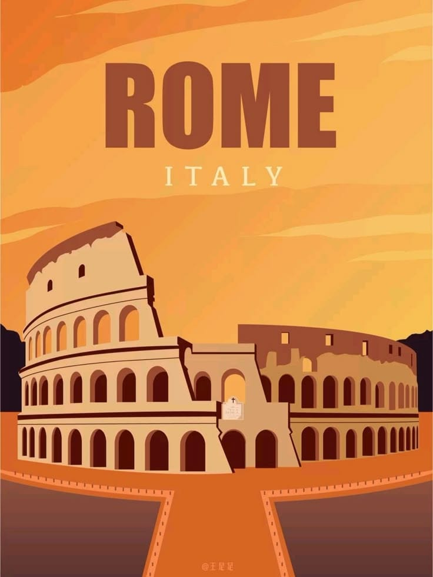
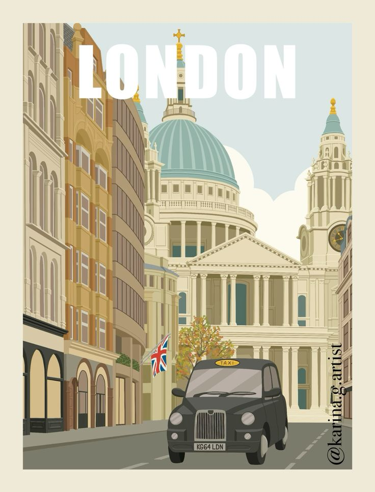
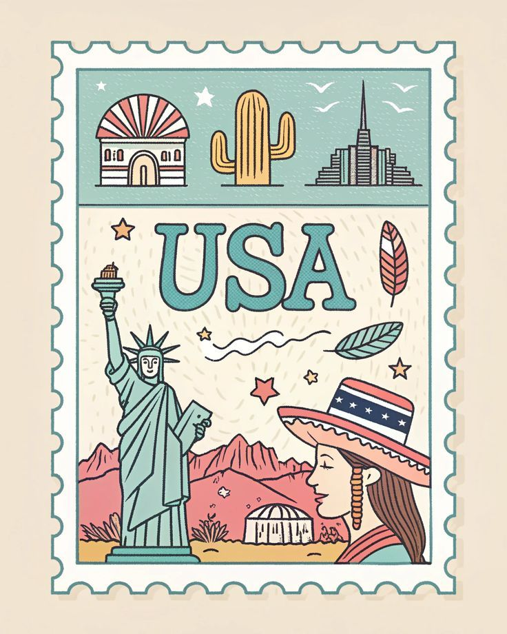
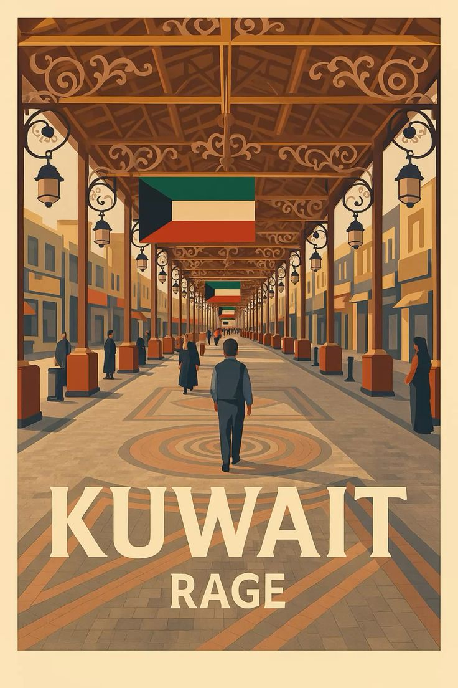

<!DOCTYPE html>
<html lang="en">
<head>
    <meta charset="UTF-8">
    <meta name="viewport" content="width=device-width, initial-scale=1.0">
    <title>Travel Home Airlines</title>

    
</head>

<body>

<header>
    <nav>
        <ul>
            <li><a href="#home">Home</a></li>
            <li><a href="#destinations">Destinations</a></li>
            <li><a href="#AboutUs">About Us</a></li>
        </ul>
    </nav>
</header>

<!-- HOME -->
<section id="home">

    <video autoplay muted loop class="home-video">
        <source src="videos/home.mp4" type="video/mp4">
    </video>

    

        <h1>Explore The World ✈️</h1>
        
Travel with us

    

</section>

<!-- DESTINATIONS -->
<section id="destinations">
    <h2>Destinations</h2>

    

        

            
            <h3>France</h3>
        

        

            
            <h3>Dubai</h3>
        

        

            
            <h3>Italy</h3>
        

        

            
            <h3>Turkey</h3>
        

        

            
            <h3>London</h3>
        

        

            
            <h3>USA</h3>
        

        

            
            <h3>Egypt</h3>
        

        

            
            <h3>Kuwait</h3>
        

        

            
            <h3>Abu Dhabi</h3>
        

        

            
            <h3>India</h3>
        

    

</section>

<!-- ABOUT -->
<section id="AboutUs">
    <h2>About Us</h2>
    
We are a leading travel company offering the best trips around the world.

</section>

</body>
</html>
